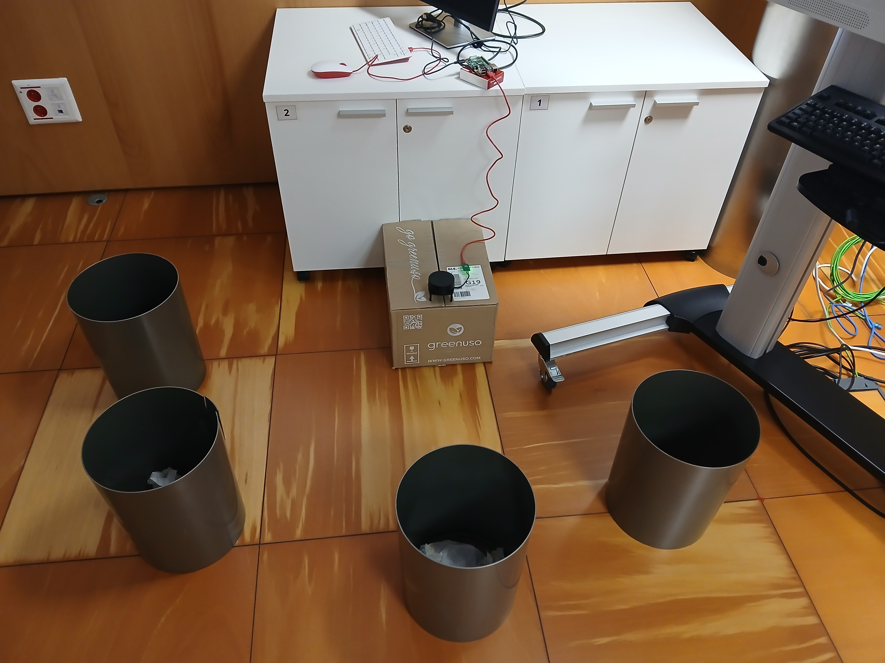
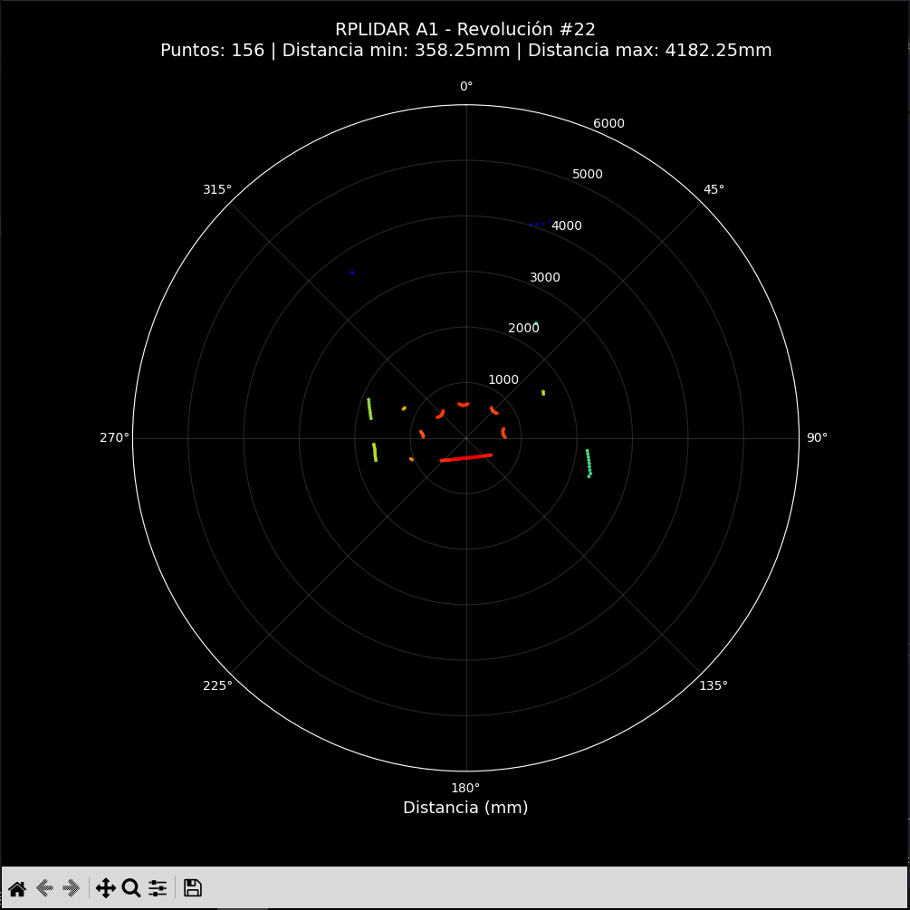

# Ejemplos de uso de lidarclient

Esta carpeta contiene ejemplos prácticos de cómo usar la librería `lidarclient` para conectarse al servidor LIDAR TCP en la Raspberry Pi.

## Requisitos previos

Antes de ejecutar cualquier ejemplo:

### 1. Servidor TCP corriendo en la Raspberry Pi

```bash
# En la Raspberry Pi, verificar que el servidor está corriendo
sudo systemctl status rplidar-server.service

# Si no está corriendo, arrancarlo
sudo systemctl start rplidar-server.service
```

### 2. Libreria instalada en tu PC

```bash
# Desde la raíz del proyecto
pip install -e .
```

### 3. Configurar tu LIDAR

IMPORTANTE: Todos los ejemplos leen la configuración desde `config.ini`
```bash
# Copiar plantilla
cp config.ini.example config.ini
# Editar con tu IP asignada
nano config.ini
```

Cambia la lines `host` por la IP de tu LIDAR asignado

```text
[lidar]
host = 192.168.1.103  # Cambia por tu LIDAR
port = 5000
timeout = 5.0
max_retries = 3
retry_delay = 2.0
```

LIDAR disponibles en el Laboratorio:

* LIDAR 1: 192.168.1.101
* LIDAR 2: 192.168.1.102
* LIDAR 3: 192.168.1.103
* LIDAR 4: 192.168.1.104
* LIDAR 5: 192.168.1.105
* LIDAR 6: 192.168.1.106

## Ejemplos disponibles

### 1. `simple_scan.py` - Lectura básica (Recomendado para empezar)

#### Qué hace:

Obtiene una sola revolución complta del LIDAR y muestra estadísticas básicas.

#### Ideal para:

* Primeras pruebas de conexión.
* Verificar que el sistema funciona correctamente.
* Entender el formato de datos (calidad, ángulo, distancia)

#### Uso:

```bash
python examples/simple_scan.py
```

#### Salida esperada:

```text
Conectando a 192.168.1.103:5000...
Conectado a 192.168.1.103:5000
Conectado a 192.168.1.103:5000
Solicitando revolución...

Revolución completa recibida
Total de puntos: 67
Puntos válidos: 65
Distancia mínima: 360.2 mm
Distancia máxima: 1907.2 mm

Primeros 5 puntos:
1. Calidad 15, Ángulo 187.81°, Distancia 1907.25 mm
2. Calidad 15, Ángulo 189.23°, Distancia 1896.25 mm
...
Desconectado del servidor
```

### 2. `continuous_stream.py` - Stream en tiempo real

#### Qué hace:

Recibe revoluciones continuamente y muestra estadísticas actualizadas en tiempo real con reconexión automática.

#### Ideal para:

* Monitoreo continuo del entorno

* Detectar cambios en el espacio escaneado

* Verificar estabilidad del sistema

* Aplicaciones que necesitan datos en tiempo real

#### Uso:

```bash
python examples/continuous_stream.py
```

#### Salida esperada:

```text
Conectando a 192.168.1.103:5000...
Conectado a 192.168.1.103:5000
Conectado al servidor LIDAR
Servidor: 192.168.1.103:5000
Presiona Ctrl+C para detener

Rev #  1: Puntos= 67 Válidos= 65 Dist.Media= 1234.5mm Min= 360.2mm Max=1907.2mm
Rev #  2: Puntos= 68 Válidos= 66 Dist.Media= 1238.1mm Min= 358.5mm Max=1912.3mm
Rev #  3: Puntos= 67 Válidos= 64 Dist.Media= 1230.7mm Min= 362.1mm Max=1905.8mm
...
```
#### Detener: Presiona `Ctrl+C` para finalizar

### 3. `print_scan_stub.py` - Formato compatible ROS 2

#### Qué hace:

Stream continuo mostrando estadísticas en formato similar a sensor_msgs/LaserScan de ROS 2 (distancias en metros, ángulos en radianes).

#### Ideal para:

* Migrar código existente de ROS 2 a TCP

* Usuarios familiarizados con el ecosistema ROS

* Debugging de cobertura angular y rango de mediciones

* Aplicaciones que esperan formato LaserScan

#### Uso:

```bash
python examples/print_scan_stub.py
```

#### Salida esperada:
```text
Conectando a 192.168.1.103:5000...
Conectado a 192.168.1.103:5000
Conectado al servidor LIDAR
Servidor: 192.168.1.103:5000
Mostrando estadísticas de escaneo (formato LaserScan)
Presiona Ctrl+C para detener

ranges=67 finite=65 min=0.360m max=1.907m angle_min=3.285 rad angle_max=6.135 rad
ranges=68 finite=66 min=0.358m max=1.912m angle_min=3.281 rad angle_max=6.139 rad
...
```
> Nota: Este ejemplo NO requiere ROS 2 instalado. Solo simula el formato de datos

#### Detener: Presiona `Ctrl+C` para finalizar

### 4. `visualize_realtime.py` - Visualización gráfica en tiempo real

#### Qué hace:

Muestra los datos del LIDAR en un gráfico polar 2D animado con actualización en tiempo real.

### Ideal para:

* Visualización intuitiva del entorno escaneado.
* Debugging visual de la cobertura del LIDAR.
* Demostraciones y presentaciones
* Educación: entender cómo ve el LIDAR
* Detectar problemas de hardware visualmente.

#### Requisitos adicionales:

```bash
pip install matplotlib numpy
```

o instalar con el grupo de dependencias:

```bash
pip install -e .[visualization]
```

#### Uso

```bash
python examples/visualize_realtime.py
```

Salida esperada:
Se abrirá una ventana gráfica mostrando:

Ademas en la terminal se muestra:
```text
Conectando a 192.168.1.103:5000...
Conectado correctamente

Iniciando visualización en tiempo real...
- Cierra la ventana o presiona Ctrl+C para detener
```

Ventana de visualización:
<p align="center">
  
  
</p>

<p align="center">
  <em>Izquierda: Estado real | Derecha: Visualización</em>
</p>


* Fondo negro con texto blanco.
* Plot polar circular (el LIDAR está en el centro).
* Puntos con gradiente de color.
* Título actualizado con estadísticas por revolución.
* Rango: 0 - 6000 mm (0 - 6 metros).

Características:
* Actualización en tiempo real cada 100ms (~10 FPS).
* Mapa de colores por distancia.
* Filtrado autmático de mediciones inválidas (distance = 0).
* Estadísticas en el título: número de puntos, distancia min/max.
* Orientación: 0º arriba, rotación horaria (como el LIDAR físico).

Controles:
* Cerrar ventana o Ctrl+C para detener.

Interpretación del gráfico:
* Centro = Posición del LIDAR.
* Ángulo = dirección de la medición (0-360º, 0º hacia arriba).
* Distancia desde el centro = Distancia al obstáculo (mm)
* Color = Gradiente por distancia (rojo= cerca, azul= lejos).

> NOTA: Si ejecutas por SSH sin display gráfico, necesitarás X11 forwarding o ejecutar localmente.

## Formato de datos del LIDAR

Todas las revoluciones se devuelven como una lista de tuplas:

```python
scan = client.get_scan()
# scan = [(quality, angle, distance),(quality, angle, distance), ...]
```

* quality (int): Confianza de la medición de (0-15, donde 15 es máxima calidad)
* angle (float): Ángulo en grados (0-360º)
* distance (float): Distancia en milímetros (0 = sin medición válida)

### Ejemplo de procesamiento.

```python
for quality, angle, distance in scan:
    if distance > 0:  # Filtrar mediciones válidas
        print(f"Objeto detectado a {angle:.1f}° y {distance:.1f} mm")
```
## Reconexión automática
Todos los ejemplos usan `connect_with_retry()` que reintenta la conexión automáticamente según la configuración en `config.ini`:

```text
max_retries = 3    # Número de reintentos
retry_delay = 2.0  # Segundos entre reintentos
```

Si el servidor no está disponible, verás:

```text
Conectando a 192.168.1.103:5000...
Falló: Conexión rechazada por 192.168.1.103:5000. Verifica que el servidor esté corriendo.
Esperando 2.0 segundos antes de reintentar...
[Intento 2/4] Reintentando conexión a 192.168.1.103:5000...
...
```

## Solución de problemas

### Error: `No se encontró el archivo 'config.ini'`

Causa: No has creado el archivo de configuración

Solución:
```bash
cp config.ini.example config.ini
nano config.ini  # Edita la IP de tu LIDAR
```

### Error: `Connection refused`

Causas posibles:

* El servidor TCP no está corriendo en la Raspberry Pi.
* La IP en `config.ini` es incorrecta
* Problema de red/firewall

Solución:

1. Verifica que el servidor está corriendo: 
```bash 
sudo systemctl status rplidar-server.service
```
2. Comprueba la IP:
```bash 
ping <IP_de_tu_config.ini>
```
3. Verifica que el puerto 5000 está abierto

```bash 
sudo ss -tlnp | grep 5000
```

### Error: `Timeout esperando datos del servidor`

Causa: el servidor está muy lento o sobrecargado

Solución: Aumenta el `timeout` en `config.ini`:

```text
timeout = 10.0
```

### Revoluciones con poco puntos válidos

Causa: Normal si el LIDAR apunta a una zona vacía o muy lejana

Rango de medición: EL RPLIDAR A1 tiene un rango típico de 0.15 - 12 metros.

### El servidor se desconecta inesperadamente

Solución:

* Verificar logs del servidor: sudo journalctl -u rplidar-server.service -f

* Verificar conexión USB del LIDAR en la RPi: ls -la /dev/ttyUSB0

* Reiniciar servidor: sudo systemctl restart rplidar-server.service

## Próximos pasos

Una vez que domines estos ejemplos puedes:

* Crear tus propias aplicaciones de procesamiento de datos LIDAR

* Implementar detección de obstáculos

* Guardar datos en CSV/JSON para análisis offline

* Visualizar el escaneo en tiempo real con matplotlib

* Integrar con sistemas de navegación robótica

## Referencias

* [Documentación principal](/README.md)
* [Configuración del servidor](/server/README.md)
* [SLAMTEC RPLIDAR A1 Datasheet](https://www.slamtec.com/en/Lidar/A1)